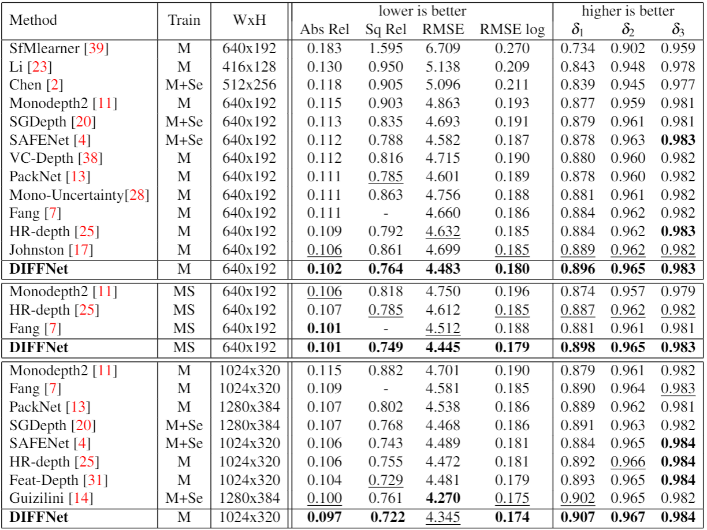
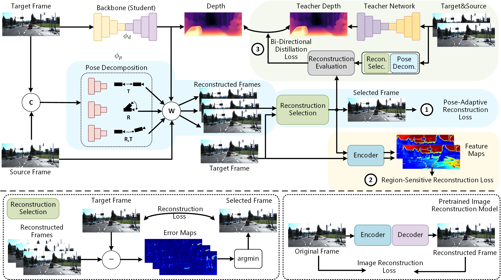

# ARC-Depth

This repo is for **Devil's in the Reconstruction: Self-Supervised Monocular Depth Estimation from Videos via Adaptive Reconstruction Constraints**

# Setup
This work is implemented using same environment as [FeatDepth](https://github.com/sconlyshootery/FeatDepth), please refer to them.

<!-- ## Comparing with others
 -->

## Method
<p align="center">
  
</p>
<p align="center">Overview of our proposed network</p>

## Training:

for student net training please use:
```
sh start2train_student.sh
```
and check the sh file to add different losses

for teacher net training please use:
```
sh start2train_teacher.sh
```

## Testing:

for student net testing please use:
```
sh disp_evaluation_student.sh
```

for teacher net testing please use:
```
sh disp_evaluation_teacher.sh
```

## Infer depth maps from RGB images in a folder:

```
sh test_sample.sh
```

#### Acknowledgement
 Thanks the authors for their works:
 - [monodepth2](https://github.com/nianticlabs/monodepth2)
 - [HRNet](https://github.com/HRNet/HRNet-Semantic-Segmentation)
 - [FeatDepth](https://github.com/sconlyshootery/FeatDepth)
 - [DIFFNet](https://github.com/brandleyzhou/DIFFNet)

## Citation

If this codebase or our method helps your research, please cite:
